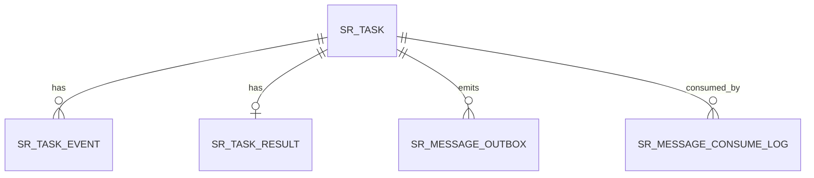

# 超分辨率重构服务交互流程与数据表设计（Java + Python）


## 数据库配置信息
- mysql8.0
- 账号密码：root/qwDFerAs1
- 运行环境：windows 本地 docker 容器
- 数据库：picture

## 1. 结论
当前方案方向正确：采用 `Java 控制面 + Python 推理面 + COS + RabbitMQ` 的解耦架构是合理的。  
要达到生产可用，建议补齐：
- Java 侧 `Outbox Relay`，保证“任务落库”和“任务消息投递”最终一致。
- Python/Java 消费端均实现幂等（按 `messageId` 或 `taskId + attempt` 去重）。
- 统一状态机并做状态流转校验，拒绝旧消息覆盖新状态。
- 保留 `sr_task_event` 事件流水用于审计、回放、排障和对账。

## 2. 端到端交互流程
1. Java 业务端接收上传请求，文件写入 COS，创建 `sr_task` 记录（状态 `CREATED/QUEUED`）。
2. Java 将待发送任务消息写入 `sr_message_outbox`，由 Relay 异步投递到 RabbitMQ `sr.task`。
3. Python 消费 `sr.task`，先做消费幂等校验，再更新运行事件（`RECEIVED/RUNNING`）。
4. Python 从 COS 下载输入文件，执行超分辨率重构（图片/视频），上传输出文件到 COS。
5. Python 发布 `sr.result` 消息（携带 `taskId/status/outputFileKey/costMs/attempt/traceId`）。
6. Java 消费 `sr.result`，幂等更新 `sr_task` 最终状态并写入 `sr_task_event`/通知记录。
7. Java 向客户端返回查询结果或推送任务完成通知（WebSocket/SSE）。

## 3. E-R 关系（核心）


关系说明：
- `sr_task`：任务主表，Java 侧主维护。
- `sr_task_event`：全链路事件表，建议 Java/Python 两侧都写入关键事件。
- `sr_task_result`：任务结果扩展表（可选，避免主表过宽）。
- `sr_message_outbox`：Java 侧本地消息表，配合 Relay 投递。
- `sr_message_consume_log`：消费去重日志表，保障至少一次投递语义下的幂等。

## 4. 表设计（MySQL 建议）

### 4.1 `sr_task`（任务主表）
- `id` bigint PK
- `task_no` varchar(64) not null unique
- `user_id` bigint not null
- `biz_type` varchar(16) not null comment 'image/video'
- `input_file_key` varchar(512) not null
- `output_file_key` varchar(512) null
- `status` varchar(16) not null comment 'CREATED/QUEUED/RUNNING/SUCCEEDED/FAILED/CANCELLED'
- `progress` tinyint not null default 0
- `scale` tinyint not null
- `model_name` varchar(64) not null
- `model_version` varchar(32) not null
- `retry_count` int not null default 0
- `max_retry` int not null default 3
- `error_code` varchar(64) null
- `error_msg` varchar(1024) null
- `trace_id` varchar(64) null
- `cancel_requested` tinyint not null default 0
- `created_at` datetime not null
- `updated_at` datetime not null

索引建议：
- `uk_task_no(task_no)`
- `idx_user_created(user_id, created_at desc)`
- `idx_status_created(status, created_at asc)`

### 4.2 `sr_task_event`（事件流水表，建议保留）
- `id` bigint PK
- `task_id` bigint not null
- `task_no` varchar(64) not null
- `event_type` varchar(32) not null comment 'CREATED/QUEUED/RECEIVED/DOWNLOADING/INFERENCING/UPLOADING/SUCCEEDED/FAILED/CANCELLED'
- `event_time` datetime not null
- `attempt` int not null default 1
- `worker_id` varchar(64) null
- `payload_json` json null
- `error_code` varchar(64) null
- `error_msg` varchar(1024) null
- `trace_id` varchar(64) null
- `created_at` datetime not null

索引建议：
- `idx_task_time(task_id, event_time asc)`
- `idx_task_event(task_id, event_type, created_at asc)`

### 4.3 `sr_task_result`（任务结果扩展表，可选）
- `id` bigint PK
- `task_id` bigint not null unique
- `output_file_key` varchar(512) not null
- `output_meta_json` json null comment '宽高、时长、码率、大小'
- `cost_ms` bigint not null
- `gpu_model` varchar(64) null
- `created_at` datetime not null

索引建议：
- `uk_task_id(task_id)`

### 4.4 `sr_message_outbox`（Java 本地消息表）
- `id` bigint PK
- `message_id` varchar(64) not null unique
- `aggregate_type` varchar(32) not null comment 'SR_TASK'
- `aggregate_id` bigint not null
- `topic` varchar(64) not null comment 'sr.task/sr.notify'
- `routing_key` varchar(128) not null
- `payload_json` json not null
- `status` varchar(16) not null comment 'NEW/SENT/FAILED'
- `retry_count` int not null default 0
- `next_retry_at` datetime null
- `created_at` datetime not null
- `updated_at` datetime not null

索引建议：
- `idx_status_next(status, next_retry_at asc)`

### 4.5 `sr_message_consume_log`（消费幂等日志表）
- `id` bigint PK
- `consumer` varchar(64) not null comment 'python-worker/java-result-consumer'
- `message_id` varchar(64) not null
- `task_id` bigint null
- `topic` varchar(64) not null
- `consumed_at` datetime not null
- `result` varchar(16) not null comment 'OK/IGNORE/ERROR'
- `error_msg` varchar(512) null

约束与索引建议：
- `uk_consumer_msg(consumer, message_id)`
- `idx_task_consume(task_id, consumed_at desc)`

## 5. 状态流转与幂等约束
- 合法状态流转：
  - `CREATED -> QUEUED -> RUNNING -> SUCCEEDED`
  - `CREATED/QUEUED/RUNNING -> FAILED`
  - `CREATED/QUEUED/RUNNING -> CANCELLED`
- Java 消费结果时执行条件更新：仅当当前状态允许流转时更新。
- Python 消费任务时先写/查 `sr_message_consume_log`，重复消息直接 `ACK + IGNORE`。
- 重试消息必须增加 `attempt` 并写入事件，超过阈值后标记 `FAILED`。

## 6. 最小落地建议
若希望尽快上线并控制复杂度，建议最小集合：
1. 必选：`sr_task` + `sr_task_event` + `sr_message_consume_log`
2. Java 侧强烈建议：`sr_message_outbox`
3. 可后置：`sr_task_result`（也可先并入 `sr_task`）

该组合可以兼顾可运行、可排障、可扩展三方面需求。

## 7. 无外键约束版建表 DDL（由程序维护关联关系）

```sql
CREATE DATABASE IF NOT EXISTS `picture`
  DEFAULT CHARACTER SET utf8mb4
  DEFAULT COLLATE utf8mb4_0900_ai_ci;
USE `picture`;

-- 1) 任务主表
CREATE TABLE IF NOT EXISTS `sr_task` (
  `id` BIGINT NOT NULL AUTO_INCREMENT COMMENT '主键',
  `task_no` VARCHAR(64) NOT NULL COMMENT '任务号',
  `user_id` BIGINT NOT NULL COMMENT '用户ID',
  `biz_type` VARCHAR(16) NOT NULL COMMENT 'image/video',
  `input_file_key` VARCHAR(512) NOT NULL COMMENT '输入文件COS key',
  `output_file_key` VARCHAR(512) DEFAULT NULL COMMENT '输出文件COS key',
  `status` VARCHAR(16) NOT NULL COMMENT 'CREATED/QUEUED/RUNNING/SUCCEEDED/FAILED/CANCELLED',
  `progress` TINYINT NOT NULL DEFAULT 0 COMMENT '进度0-100',
  `scale` TINYINT NOT NULL COMMENT '超分倍率',
  `model_name` VARCHAR(64) NOT NULL COMMENT '模型名',
  `model_version` VARCHAR(32) NOT NULL COMMENT '模型版本',
  `retry_count` INT NOT NULL DEFAULT 0 COMMENT '已重试次数',
  `max_retry` INT NOT NULL DEFAULT 3 COMMENT '最大重试次数',
  `error_code` VARCHAR(64) DEFAULT NULL COMMENT '错误码',
  `error_msg` VARCHAR(1024) DEFAULT NULL COMMENT '错误信息',
  `trace_id` VARCHAR(64) DEFAULT NULL COMMENT '链路追踪ID',
  `cancel_requested` TINYINT NOT NULL DEFAULT 0 COMMENT '是否请求取消',
  `created_at` DATETIME NOT NULL DEFAULT CURRENT_TIMESTAMP,
  `updated_at` DATETIME NOT NULL DEFAULT CURRENT_TIMESTAMP ON UPDATE CURRENT_TIMESTAMP,
  PRIMARY KEY (`id`),
  UNIQUE KEY `uk_task_no` (`task_no`),
  KEY `idx_user_created` (`user_id`, `created_at` DESC),
  KEY `idx_status_created` (`status`, `created_at` ASC)
) ENGINE=InnoDB DEFAULT CHARSET=utf8mb4 COLLATE=utf8mb4_0900_ai_ci COMMENT='超分任务主表';

-- 2) 任务事件流水表
CREATE TABLE IF NOT EXISTS `sr_task_event` (
  `id` BIGINT NOT NULL AUTO_INCREMENT COMMENT '主键',
  `task_id` BIGINT NOT NULL COMMENT '任务ID（程序维护关联 sr_task.id）',
  `task_no` VARCHAR(64) NOT NULL COMMENT '任务号',
  `event_type` VARCHAR(32) NOT NULL COMMENT 'CREATED/QUEUED/RECEIVED/DOWNLOADING/INFERENCING/UPLOADING/SUCCEEDED/FAILED/CANCELLED',
  `event_time` DATETIME NOT NULL COMMENT '事件发生时间',
  `attempt` INT NOT NULL DEFAULT 1 COMMENT '第几次尝试',
  `worker_id` VARCHAR(64) DEFAULT NULL COMMENT '工作进程标识',
  `payload_json` JSON DEFAULT NULL COMMENT '扩展载荷',
  `error_code` VARCHAR(64) DEFAULT NULL COMMENT '错误码',
  `error_msg` VARCHAR(1024) DEFAULT NULL COMMENT '错误信息',
  `trace_id` VARCHAR(64) DEFAULT NULL COMMENT '链路追踪ID',
  `created_at` DATETIME NOT NULL DEFAULT CURRENT_TIMESTAMP,
  PRIMARY KEY (`id`),
  KEY `idx_task_time` (`task_id`, `event_time` ASC),
  KEY `idx_task_event` (`task_id`, `event_type`, `created_at` ASC)
) ENGINE=InnoDB DEFAULT CHARSET=utf8mb4 COLLATE=utf8mb4_0900_ai_ci COMMENT='任务事件流水';

-- 3) 任务结果扩展表（可选）
CREATE TABLE IF NOT EXISTS `sr_task_result` (
  `id` BIGINT NOT NULL AUTO_INCREMENT COMMENT '主键',
  `task_id` BIGINT NOT NULL COMMENT '任务ID（程序维护关联 sr_task.id）',
  `output_file_key` VARCHAR(512) NOT NULL COMMENT '输出文件COS key',
  `output_meta_json` JSON DEFAULT NULL COMMENT '宽高、时长、码率、大小',
  `cost_ms` BIGINT NOT NULL COMMENT '处理耗时毫秒',
  `gpu_model` VARCHAR(64) DEFAULT NULL COMMENT 'GPU型号',
  `created_at` DATETIME NOT NULL DEFAULT CURRENT_TIMESTAMP,
  PRIMARY KEY (`id`),
  UNIQUE KEY `uk_task_id` (`task_id`)
) ENGINE=InnoDB DEFAULT CHARSET=utf8mb4 COLLATE=utf8mb4_0900_ai_ci COMMENT='任务结果扩展';

-- 4) 本地消息外发表（Outbox）
CREATE TABLE IF NOT EXISTS `sr_message_outbox` (
  `id` BIGINT NOT NULL AUTO_INCREMENT COMMENT '主键',
  `message_id` VARCHAR(64) NOT NULL COMMENT '消息唯一ID',
  `aggregate_type` VARCHAR(32) NOT NULL COMMENT 'SR_TASK',
  `aggregate_id` BIGINT NOT NULL COMMENT '聚合根ID(任务ID)',
  `topic` VARCHAR(64) NOT NULL COMMENT 'sr.task/sr.notify',
  `routing_key` VARCHAR(128) NOT NULL COMMENT '路由键',
  `payload_json` JSON NOT NULL COMMENT '消息体',
  `status` VARCHAR(16) NOT NULL COMMENT 'NEW/SENT/FAILED',
  `retry_count` INT NOT NULL DEFAULT 0 COMMENT '重试次数',
  `next_retry_at` DATETIME DEFAULT NULL COMMENT '下次重试时间',
  `created_at` DATETIME NOT NULL DEFAULT CURRENT_TIMESTAMP,
  `updated_at` DATETIME NOT NULL DEFAULT CURRENT_TIMESTAMP ON UPDATE CURRENT_TIMESTAMP,
  PRIMARY KEY (`id`),
  UNIQUE KEY `uk_message_id` (`message_id`),
  KEY `idx_status_next` (`status`, `next_retry_at` ASC),
  KEY `idx_aggregate` (`aggregate_type`, `aggregate_id`)
) ENGINE=InnoDB DEFAULT CHARSET=utf8mb4 COLLATE=utf8mb4_0900_ai_ci COMMENT='消息外发表';

-- 5) 消费幂等日志表
CREATE TABLE IF NOT EXISTS `sr_message_consume_log` (
  `id` BIGINT NOT NULL AUTO_INCREMENT COMMENT '主键',
  `consumer` VARCHAR(64) NOT NULL COMMENT 'python-worker/java-result-consumer',
  `message_id` VARCHAR(64) NOT NULL COMMENT '消息唯一ID',
  `task_id` BIGINT DEFAULT NULL COMMENT '任务ID（程序维护关联 sr_task.id）',
  `topic` VARCHAR(64) NOT NULL COMMENT '主题',
  `consumed_at` DATETIME NOT NULL DEFAULT CURRENT_TIMESTAMP COMMENT '消费时间',
  `result` VARCHAR(16) NOT NULL COMMENT 'OK/IGNORE/ERROR',
  `error_msg` VARCHAR(512) DEFAULT NULL COMMENT '错误信息',
  PRIMARY KEY (`id`),
  UNIQUE KEY `uk_consumer_msg` (`consumer`, `message_id`),
  KEY `idx_task_consume` (`task_id`, `consumed_at` DESC)
) ENGINE=InnoDB DEFAULT CHARSET=utf8mb4 COLLATE=utf8mb4_0900_ai_ci COMMENT='消费幂等日志';
```
